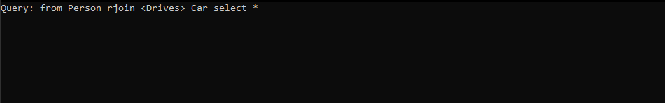
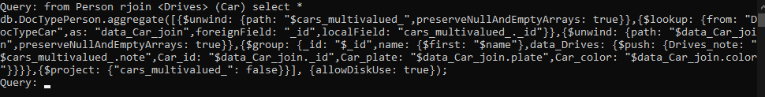

## TestApp

This application provides a way to test query generation in run time, you can type the query and it will generate the corresponding MongoDB query.

It requires a mapping file to be loaded (it is hardcoded on Program.cs on lin 12).

## Testing a query

Enter a query:

Type enter and check the results:

